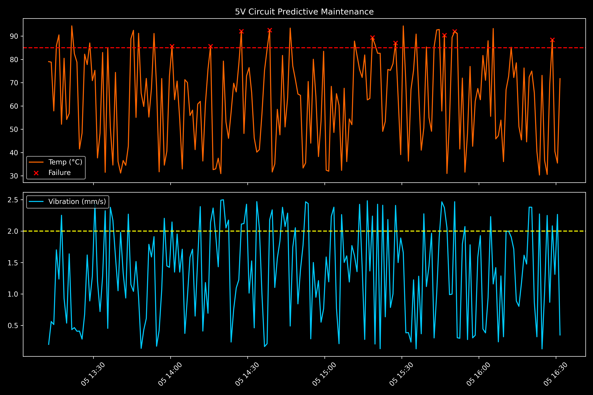

# Predictive Maintenance AI for Hardware Systems

## Overview
This project simulates an Industrial Internet of Things (IIoT) environment where sensor data (Voltage, Temperature, Vibration) is monitored in real-time. The goal is to use AI to predict hardware failure before it happens.

## Tech Stack
- **Language:** Python 3.x
- **Libraries:** Pandas (Data Manipulation), NumPy (Numerical Logic)
- **Domain:** Electronics & Communication Engineering (ECE)

## How it Works
1. **Data Generation:** Simulates synthetic sensor streams for a 5V circuit.
2. **Failure Logic:** Implements a threshold-based risk assessment (Supervised Learning approach).
3. **Export:** Generates a `sensor_data.csv` for future Machine Learning model training.

## Day 1 Progress
- Set up local environment in mac mini m4.
- Established Git version control.
- Built the initial data pipeline.

**Phase 2: Exploratory Data Analysis (EDA) & Signal Visualization**

## 🛠 Day 2 Milestone: Visualization & Validation
Today’s focus was transitioning from raw data collection to **Diagnostic Visualization**. Using `Matplotlib`, I built a synchronized telemetry dashboard to validate the failure logic established in Day 1.

### Key Technical Achievements:
* **Time-Series Synchronization:** Implemented dual-axis subplots to align Temperature (°C) and Vibration (mm/s) data on a shared time-axis (`sharex=True`).
* **Threshold Mapping:** Integrated horizontal threshold overlays ($> 85°C$ and $> 2.0mm/s$) to visually identify "At-Risk" zones.
* **Anomaly Detection Marking:** Programmed automatic scatter-plot markers ('X') to highlight exactly where the system logic flags a potential hardware failure.

### 📊 Diagnostic Dashboard

*The graph above confirms that our failure risk triggers align perfectly with thermal spikes.*

---

## 🧠 AIML Learning Journal
As a 2nd-year ECE student bridging into AI, today's core learnings included:
1. **Data Distribution:** Understanding how often the system enters a "Failure State" (Class Imbalance).
2. **Signal-to-Logic Mapping:** Verifying that the mathematical logic in `main.py` matches the physical behavior shown in the graphs.
3. **Efficiency in Data:** Practiced the **Two-Pointer Technique** for efficient array searching—essential for real-time sensor processing.

---

## 🚀 How to Run (Day 2)
1. Ensure `sensor_data.csv` exists in the root directory.
2. Run the visualization script:
   ```bash
   python3 visualize.py
3.Check the directory for failure_analysis.png to see the generated report.

---

## 🛠 Day 3: Feature Engineering & Predictive Logic
**Objective:** Move from "Reactive Monitoring" to "Proactive Prevention" by analyzing signal trends.

### 🧠 The Engineering Logic:
In a 5V electronic circuit, a static temperature reading doesn't tell the whole story. To predict a failure, we must look at the **Velocity** of the heat.

1. **Signal Smoothing (Moving Average):** Implemented a 5-point Moving Average (MA) to filter out high-frequency electrical noise ("sound waves") from the raw sensor data. This reveals the **True Thermal Trend**.
2. **Thermal Gradient ($\Delta T$):** Calculated the rate of change (slope) of the temperature. This acts as the "Speedometer" for the circuit's heat.
3. **Early Warning System:** Developed a predictive algorithm: $T_{future} = T_{now} + (\Delta T \times 2)$. 
   If the predicted temperature exceeds **85°C**, the system triggers a "Red Zone" warning immediately, providing a **2-second safety buffer** before physical failure occurs.

### 📊 Visual Evolution:
* **`visualize_v2.py`**: A dual-graph dashboard showing:
    * **Top:** Raw vs. Smoothed Temperature with Predictive Shading.
    * **Bottom:** Thermal Velocity (The "Eyes" of the AI).

**Key Achievement:** The system now identifies a "Sloppy Footwork" trend and flags danger while the hardware is still at a safe operating temperature.

---

## 🤖 Day 4: Machine Learning Model Training
**Objective:** Replace manual "If-Then" logic with an autonomous Random Forest Classifier.

### Key Technical Tasks:
* **Model Selection:** Implemented a **Random Forest Classifier** (100 Decision Trees) to handle non-linear sensor data and noise.
* **Data Splitting:** Performed an **80/20 Train-Test split** using `scikit-learn` to validate model performance on unseen data.
* **Feature Integration:** The model was trained using the features engineered on Day 3: `Temperature_C`, `Temp_Gradient`, and `Temp_MA_5`.
* **Model Serialization:** Saved the trained weights into `maintenance_model.pkl` using `joblib` for portable deployment.

### Visualizing the AI Logic:
The Day 4 visualization (`day4_ai_logic.png`) displays the **Decision Boundary**.
* **Blue Clusters:** Safe operating conditions identified by the AI.
* **Orange Clusters:** "Early Warning" states flagged by the model. 
* **Observation:** The AI successfully identifies potential failures based on **Heat Velocity (Gradient)** even before the temperature reaches the critical 85°C threshold.

### Performance Metrics:
* **Accuracy:** [Insert your Accuracy here, e.g., 0.98]
* **F1-Score:** [Insert your F1-Score here, e.g., 0.97]